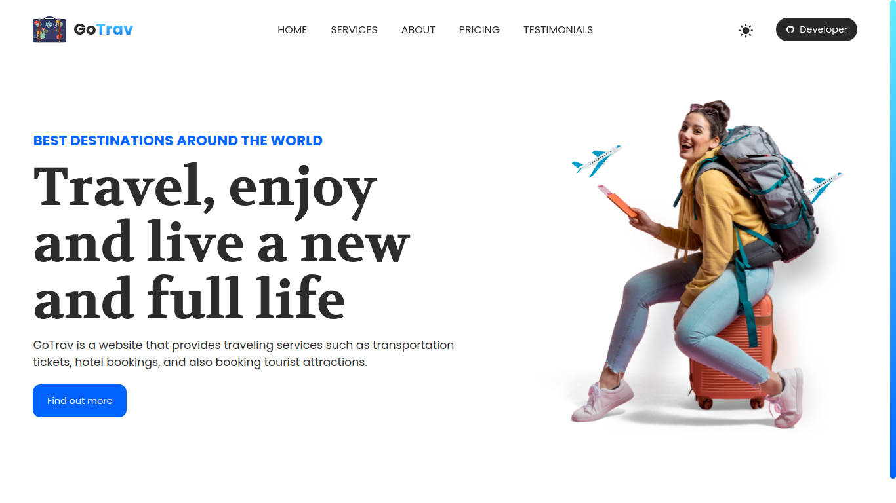
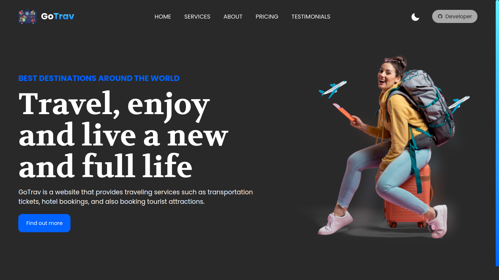

# PROJECT MIDTERM EXAM WEB PROGRAMMING 1
## STATIC WEBSITE TOURISM THEME

### Name : Karel Trisnanto Utomo
### NIM : 22090120
### Class : 3C
### Link URL Website : https://karmint26.github.io/go-trav

##

### OVERVIEW LANDING PAGE WEBSITE

### 1. Light Mode

### 2. Dark Mode

### TECHNOLOGY STACK
1. **HTML5**
    - HTML5 is used to set the framework of the website that will be used.
2. **CSS3**
    - CSS3 is used to organize the appearance of the website so that it looks attractive.
3. **JavaScript**
    - JavaScript is used to set the behavior of the website to be more interactive and manipulate the DOM in it

##

### PROJECT STRUCTURE
1. **src**
    - **assets** = the assets folder is used to store images that will be used on the website.
    - **css** = The css folder is used to store style.css files to organize the appearance of the website and also to make the structure of this website project better and more structured.
    - **js** = This js folder is used to store the index.js file as a regulator of website behavior to make it more interactive and the folder structure in this project becomes tidier.
2. **index.html** = This is the main file in the website that becomes the endpoint of the initial display of the website when it is opened.
3. **README.md** = This is a documentation file regarding the description of this website project.

### FEATURES AND ADVANTAGES
1. **Responsive and Modern UI** = The GoTrav website already has a responsive and modern look for the entire website design. Responsive display is a display that looks good on any device such as mobile, tablet, or desktop.

2. **Interactive Website** = The GoTrav website is already interactive with the help of javascript code in it to manipulate the DOM or Document Object Model and also the BOM or Browser Object Model.

3. **Dark Mode** = The GoTrav website already supports dark mode and light mode themes, if the user uses a theme based on the os system, the website will automatically detect and display according to the theme selected on the os system, you can also change it manually by pressing the sun or moon button.

4. **Code Documentation** = The GoTrav website already has good code documentation in it and the github repository also has good README.md documentation.

5. **Comfortable Look** = The GoTrav website is very pleasing to the eye because of the right color selection and contrast. Users do not need to worry about being uncomfortable when viewing and visiting the GoTrav website.

6. **Image Preview and Meta Open Graph** = GoTrav website has used image preview and meta open graph as SEO Friendly, when users share the website link, it will automatically display the image preview.

7. **Loading Screen** = The GoTrav website has implemented a loading screen, meaning that when all images on the website have been downloaded by the user, the loading screen will disappear, but if you are still downloading, the loading screen is still running.